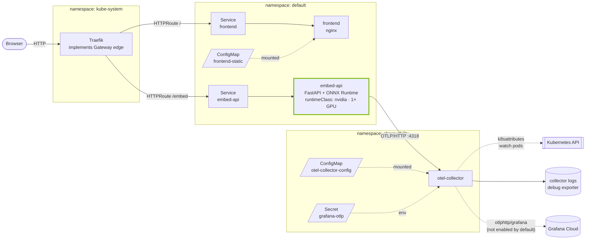

## Kubernetes Deployment (reference only)
The main app is serverless and will stay that way. This folder shows how embed-visual could run as a server instead: a set of Kubernetes manifests for a k3s cluster with an NVIDIA GPU.

It replaces the GitHub Pages frontend and the AWS Lambda with:

- **Traefik** (k3s's bundled ingress) acting as a Gateway API gateway, routing `/embed` to the API and everything else to the frontend
- **frontend**: nginx serving the same static site from a ConfigMap
- **embed-api**: a FastAPI server running the same MiniLM ONNX model, on GPU via ONNX Runtime's CUDA provider
- **otel-collector**: receives traces and metrics from the API and enriches them with pod/node metadata

This is a reference, not a live deployment. I won't maintain it as actively as the serverless version, but I'll try to bring it up to date when the serverless version changes. Feel free to swap in a bigger model, or one that suits your hardware better.



### Prerequisites
- k3s with the NVIDIA container toolkit and device plugin installed, so the `nvidia` RuntimeClass and `nvidia.com/gpu` resource exist
- Docker and Python 3.12 for building the image

### Build
```bash
pip install -r requirements-dev.txt
python export.py                                   # writes model/
docker build -t embed-api:0.1.0 .
docker save embed-api:0.1.0 | sudo k3s ctr images import -
```
The Deployment uses `imagePullPolicy: Never`, so the image must already be on the node.

### Deploy
```bash
kubectl apply -f k8s/traefik-gateway.yaml          # enable Traefik's Gateway API provider; wait for Traefik to restart
kubectl apply -f k8s/00-namespace.yaml
kubectl -n observability create secret generic grafana-otlp \
  --from-literal=GRAFANA_OTLP_ENDPOINT=... \
  --from-literal=GRAFANA_INSTANCE_ID=... \
  --from-literal=GRAFANA_OTLP_TOKEN=...
kubectl apply -f k8s/
```
The collector won't start without the `grafana-otlp` secret. Out of the box it only exports to its own logs (`debug`); add `otlphttp/grafana` to the pipeline exporters to ship to Grafana Cloud.

If you edit anything in `k8s/frontend/`, regenerate the ConfigMap:
```bash
kubectl create configmap frontend-static --from-file=k8s/frontend \
  --dry-run=client -o yaml > k8s/frontend-configmap.yaml
```

### Notes
- **Rollout strategy.** The API uses `Recreate` because there's one GPU: under `RollingUpdate`, the new pod would sit `Pending` while the old one holds the GPU. With more than one GPU you can switch to `RollingUpdate`.
- **No GPU?** Set `REQUIRE_GPU=0` and `ORT_PROVIDERS=CPUExecutionProvider`, and drop `runtimeClassName` and the GPU limit.
- **GPU memory.** ONNX Runtime is capped at 1 GiB by default; change it with `GPU_MEM_LIMIT_BYTES`.